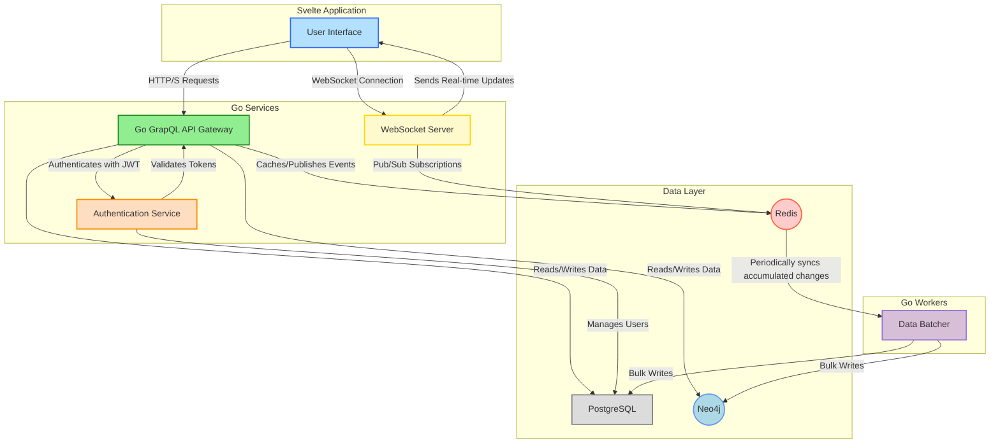
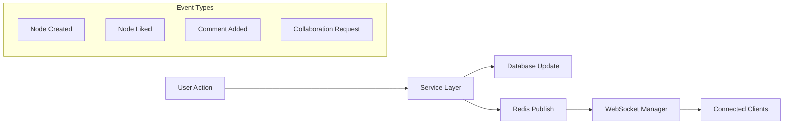

Keywords: #neo4j #postgresql #redis #graphql #go #svelte #docker
## Summary

The Human Intelligence platform is a social knowledge-collaboration system where users create, share, and explore interconnected trees of knowledge. This document outlines the technical architecture designed to support rapid scaling while maintaining the flexibility needed for a social platform centered around graph-based knowledge structures.

## Architecture Philosophy

### Core Principles

**Graph-First Thinking**: Our domain is inherently relational - users, knowledge trees, nodes, collaborations, and citations form a natural graph. We embrace this from day one rather than fighting against it with traditional relational models.

**Polyglot Persistence**: Different data has different access patterns. We optimize storage choices for each data type rather than forcing everything into a single database paradigm.

**Real-time Collaboration**: Knowledge building is social and iterative. Our architecture supports live collaboration, real-time updates, and immediate feedback loops that make the platform feel alive.

**Scale-Ready Foundations**: We're building for growth from the start, choosing technologies and patterns that can handle millions of users without fundamental rewrites.

## Simplified System Overview




## Data Architecture: Hybrid Graph + Relational

### The Two-Database Strategy

**Neo4j (Graph Database) - The Relationship Engine**
- Knowledge trees and node hierarchies
- User collaborations and social connections
- Content citations and references
- Like/vote relationships for recommendations
- All traversal-heavy operations

**PostgreSQL (Relational Database) - The Data Warehouse**
- User profiles and authentication data
- Full node content and rich media
- System logs and analytics
- Billing and subscription management
- Full-text search indices

## Technology Stack Decisions

### Backend: Go with Goroutines
**Why Go?**
- Exceptional concurrency model perfect for real-time features
- Native goroutines handle thousands of WebSocket connections efficiently
- Strong ecosystem for graph databases and GraphQL
- Excellent performance for API-heavy workloads

**Concurrency Architecture:**
```go
// WebSocket connection manager
type ConnectionManager struct {
    connections map[string]*websocket.Conn
    broadcast   chan []byte
    register    chan *websocket.Conn
    unregister  chan *websocket.Conn
}

// Each user gets their own goroutine for real-time updates
func (cm *ConnectionManager) handleConnection(conn *websocket.Conn) {
    go func() {
        defer conn.Close()
        for {
            select {
            case message := <-userChannel:
                conn.WriteJSON(message)
            case <-ctx.Done():
                return
            }
        }
    }()
}
```

### Frontend: Svelte
**Why Svelte?**
- Minimal runtime overhead for complex tree visualizations
- Reactive updates perfect for real-time collaboration
- Excellent developer experience for rapid iteration
- Strong TypeScript support for type-safe API integration

### API Layer: GraphQL + REST 
**GraphQL for Knowledge Operations:**
- Perfect for tree traversal queries
- Efficient data fetching for complex node relationships
- Real-time subscriptions for live collaboration

**REST for System Operations:**
- File uploads and binary data
- Authentication flows
- Webhooks and integrations

### Real-time Layer: Redis + WebSockets
**Redis Pub/Sub Pattern:**
```go
// Publisher (after like action)
func (s *TreeService) LikeNode(nodeID string, userID string) error {
    // Update Neo4j relationship
    neo4j.CreateRelationship(userID, "LIKES", nodeID)
    
    // Broadcast real-time update
    redis.Publish("node_updates", NodeUpdateEvent{
        Type: "like_added",
        NodeID: nodeID,
        UserID: userID,
        Timestamp: time.Now(),
    })
}

// Subscriber (WebSocket manager)
func (ws *WebSocketManager) listenForUpdates() {
    pubsub := redis.Subscribe("node_updates")
    for msg := range pubsub.Channel() {
        // Broadcast to all connected clients viewing this node
        ws.broadcastToSubscribers(msg.Payload)
    }
}
```

## Detailed Component Architecture

### User Service
**Responsibilities:**
- User authentication and authorization
- Profile management and gamification
- Social features (following, blocking)
- Knowledge area expertise tracking

**Data Split:**
```cypher
// Neo4j: Relationships only
(User {id: "user123", username: "john_doe"})
(User)-[:FOLLOWS]->(User)
(User)-[:EXPERT_IN]->(KnowledgeArea)

// PostgreSQL: Rich profile data
users: id, email, password_hash, full_name, bio, avatar_url,
       preferences_json, subscription_tier, created_at
```

### Tree Service  
**Responsibilities:**
- Knowledge tree CRUD operations
- Node branching and merging logic
- Content versioning and history
- Collaboration request management

**Core Operations:**
```go
type TreeService struct {
    neo4j    *neo4j.Driver
    postgres *sql.DB
    redis    *redis.Client
}

func (ts *TreeService) BranchFromNode(parentNodeID, userID string, content NodeContent) (*Node, error) {
    // Create graph relationship in Neo4j
    // Store content in PostgreSQL  
    // Notify collaborators via Redis
}
```

### Collaboration Service
**Responsibilities:**
- Real-time collaborative editing
- Merge request workflows
- Comment and discussion threading
- Conflict resolution for simultaneous edits

### Search Service
**Responsibilities:**
- Full-text search across node content
- Tag-based filtering and discovery
- User expertise search
- Content algorithms

**Technology:** Elasticsearch for advanced search capabilities

## Data Models

### Neo4j Schema

```cypher
// Core Entities
CREATE CONSTRAINT user_id FOR (u:User) REQUIRE u.id IS UNIQUE;
CREATE CONSTRAINT tree_id FOR (t:Tree) REQUIRE t.id IS UNIQUE;
CREATE CONSTRAINT node_id FOR (n:Node) REQUIRE n.id IS UNIQUE;

// Relationship Types
(:User)-[:OWNS]->(:Tree)
(:User)-[:CONTRIBUTES_TO]->(:Node)
(:User)-[:LIKES]->(:Node)
(:User)-[:FOLLOWS]->(:User)
(:Node)-[:BRANCHES_FROM]->(:Node)
(:Node)-[:CITES]->(:Source)
(:Node)-[:TAGGED_WITH]->(:Tag)
(:Tree)-[:CATEGORIZED_AS]->(:Category)
```

### PostgreSQL Schema

```sql
-- User Management
CREATE TABLE users (
    id UUID PRIMARY KEY,
    username VARCHAR(50) UNIQUE NOT NULL,
    email VARCHAR(255) UNIQUE NOT NULL,
    password_hash TEXT NOT NULL,
    full_name VARCHAR(255),
    bio TEXT,
    avatar_url TEXT,
    preferences JSONB DEFAULT '{}',
    subscription_tier VARCHAR(20) DEFAULT 'free',
    created_at TIMESTAMP DEFAULT NOW(),
    updated_at TIMESTAMP DEFAULT NOW()
);

-- Rich Content Storage
CREATE TABLE nodes (
    id UUID PRIMARY KEY,
    title VARCHAR(500) NOT NULL,
    content TEXT NOT NULL,
    content_html TEXT, -- Rendered markdown cache
    word_count INTEGER,
    reading_time_minutes INTEGER,
    version INTEGER DEFAULT 1,
    edit_history JSONB DEFAULT '[]',
    created_at TIMESTAMP DEFAULT NOW(),
    updated_at TIMESTAMP DEFAULT NOW()
);

-- File Management
CREATE TABLE attachments (
    id UUID PRIMARY KEY,
    node_id UUID REFERENCES nodes(id),
    filename VARCHAR(255),
    file_size BIGINT,
    mime_type VARCHAR(100),
    storage_url TEXT,
    uploaded_at TIMESTAMP DEFAULT NOW()
);
```

## API Design Examples

### GraphQL Schema Highlights

```graphql
type User {
  id: ID!
  username: String!
  bio: String
  knowledgeAreas: [String!]!
  stats: UserStats!
  ownedTrees: [Tree!]!
  contributedNodes: [Node!]!
}

type Tree {
  id: ID!
  title: String!
  description: String
  isPrivate: Boolean!
  owner: User!
  rootNode: Node!
  collaborators: [User!]!
  tags: [String!]!
}

type Node {
  id: ID!
  title: String!
  content: String!
  summary: String
  classification: ContentClassification!
  author: User!
  parent: Node
  children: [Node!]!
  likes: Int!
  userHasLiked: Boolean!
  comments: [Comment!]!
  sources: [Source!]!
}

# Real-time subscriptions
type Subscription {
  nodeUpdated(treeId: ID!): NodeUpdateEvent!
  newCollaborationRequest: CollaborationRequest!
  userNotifications: Notification!
}
```

### Key Queries

```graphql
# Tree exploration with path traversal
query ExploreTree($treeId: ID!, $maxDepth: Int = 5) {
  tree(id: $treeId) {
    title
    rootNode {
      ...nodeFragment
      children(depth: $maxDepth) {
        ...nodeFragment
        children {
          ...nodeFragment
        }
      }
    }
  }
}

# User knowledge graph
query UserKnowledgeMap($userId: ID!) {
  user(id: $userId) {
    contributedNodes {
      tree {
        title
        category
      }
      tags
      likesReceived
    }
    collaborations {
      tree {
        title
        owner {
          username
        }
      }
      contributionCount
    }
  }
}
```

## Real-time Architecture Deep Dive

### WebSocket Connection Management

```go
type SubscriptionManager struct {
    // Map of treeID -> list of connected users
    treeSubscriptions map[string]map[string]*websocket.Conn
    // Map of userID -> connection
    userConnections   map[string]*websocket.Conn
    mutex            sync.RWMutex
    redis            *redis.Client
}

func (sm *SubscriptionManager) HandleTreeSubscription(conn *websocket.Conn, treeID, userID string) {
    sm.mutex.Lock()
    if sm.treeSubscriptions[treeID] == nil {
        sm.treeSubscriptions[treeID] = make(map[string]*websocket.Conn)
    }
    sm.treeSubscriptions[treeID][userID] = conn
    sm.mutex.Unlock()
    
    // Subscribe to Redis updates for this tree
    go sm.listenForTreeUpdates(treeID)
}
```

### Event Broadcasting Strategy



## Security Architecture

### Authentication & Authorization
- JWT tokens for stateless authentication
- Role-based access control (RBAC) for trees and nodes
- Rate limiting per user and IP
- Content sanitization and XSS protection

### Data Privacy
- Private trees encrypted at rest
- Granular sharing permissions
- GDPR compliance for user data deletion
- Audit logs for all sensitive operations

## Performance & Scaling Strategy

### Caching Layer
```go
type CacheStrategy struct {
    // L1: In-memory cache for hot data
    localCache *bigcache.BigCache
    // L2: Redis for shared cache
    redisCache *redis.Client
    // L3: Database for cold data
    databases  DatabaseCluster
}

// Cache popular tree paths for instant loading
func (cs *CacheStrategy) GetTreePath(treeID, pathID string) (*TreePath, error) {
    // Check L1 cache first
    if path := cs.localCache.Get(pathID); path != nil {
        return path, nil
    }
    
    // Check Redis
    if path := cs.redisCache.Get(pathID); path != nil {
        cs.localCache.Set(pathID, path) // Populate L1
        return path, nil
    }
    
    // Fetch from database and populate caches
    path := cs.databases.QueryTreePath(treeID, pathID)
    cs.redisCache.Set(pathID, path, 1*time.Hour)
    cs.localCache.Set(pathID, path)
    return path, nil
}
```

### Database Scaling Patterns
- **Neo4j**: Read replicas for query scaling
- **PostgreSQL**: Horizontal sharding by user_id
- **Redis**: Clustering for high availability

## Development & Deployment Strategy

### Testing Strategy
- Unit tests for business logic
- Integration tests for database operations  
- End-to-end tests for critical user flows
- Load testing for WebSocket connections
- Chaos engineering for resilience testing

## Monitoring & Observability

### Key Metrics to Track
- **User Engagement**: Active collaborators, tree creation rate, node interaction frequency
- **System Performance**: API response times, database query performance, WebSocket connection health
- **Business Metrics**: User retention, collaboration success rate, content quality scores

### Logging Strategy
```go
// Structured logging with context
logger.WithFields(logrus.Fields{
    "user_id":    userID,
    "tree_id":    treeID,
    "action":     "node_creation",
    "duration":   duration,
    "node_count": nodeCount,
}).Info("Node created successfully")
```

## Future Enhancements (Post-MVP)

### Phase 2: AI Integration
- **Automatic Tree Suggestions**: ML models suggest knowledge paths based on user interests
- **Content Quality Scoring**: AI-powered fact-checking and source validation
- **Smart Citations**: Automatic source discovery and citation formatting
- **Translation Services**: Multi-language support for global collaboration

### Phase 3: Advanced Features
- **Version Control**: Git-like branching and merging for knowledge trees
- **Advanced Analytics**: Knowledge graph analysis and insight discovery
- **API Ecosystem**: Public APIs for third-party integrations
- **Mobile Applications**: Native iOS and Android apps

### Phase 4: Enterprise Features
- **White-label Solutions**: Customizable instances for organizations
- **Advanced Administration**: Detailed user management and content moderation
- **Integration APIs**: Connect with learning management systems
- **Advanced Security**: SSO, audit trails, compliance reporting

## Risk Mitigation

### Technical
- **Database Scaling**: Hybrid architecture allows independent scaling of graph vs relational data
- **Real-time Performance**: Redis clustering and connection pooling handle WebSocket load
- **Data Consistency**: Event sourcing patterns ensure consistency across databases

### Business  
- **Content Quality**: Community moderation tools and reputation systems
- **User Adoption**: Gamification and social features drive engagement
- **Monetization**: Freemium model with clear value propositions for paid tiers

## Conclusion

This architecture positions Human Intelligence for rapid growth while maintaining the flexibility needed for a social platform. The hybrid database approach optimizes for both graph traversal performance and rich content management. The real-time collaboration features create an engaging user experience that encourages knowledge sharing and community building.

The technology choices (Go, Svelte, Neo4j, PostgreSQL, Redis) provide a modern, scalable foundation that can evolve with the platform's needs. The clear separation of concerns and microservices architecture allows the development team to work efficiently while maintaining system reliability.

By building these patterns from day one, we avoid the technical debt that often comes from starting simple and scaling later. This investment in architecture will pay dividends as Human Intelligence grows into the collaborative knowledge platform of the future.